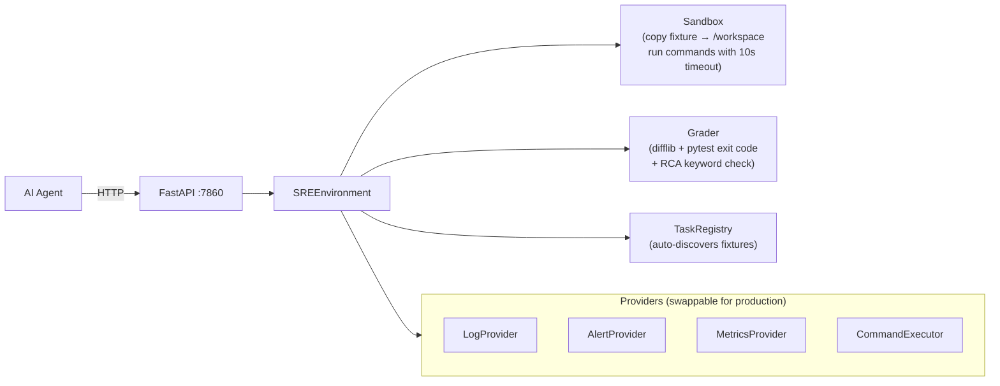

# SRE Incident Response — OpenEnv RL Environment (Final)

## Goal

Build an OpenEnv-compliant environment where an AI agent **diagnoses and fixes production incidents**: read alerts and logs, identify root cause, edit code, run tests, write an RCA document. Sandboxed in Docker, deployed on Hugging Face Spaces.

---

## Decisions

| Decision | Choice | Why |
|---|---|---|
| Git | **None** | Grader uses `difflib` to compare workspace vs fixture. Simpler, fewer failure points. |
| Command safety | **10s timeout only** | Docker isolation handles the rest. No bloated middleware. |
| Action space | **3 tools**: `terminal`, `editor`, `submit` | Clean, minimal, easy for agents to learn |
| Scalability | **Provider pattern** | Abstractions in code + README = high real-world utility score |
| Code style | **PEP-8 via ruff** | Professional quality, judges notice |
| RCA grading | **Regex + keyword** | Deterministic, reproducible |
| LLM baseline | **Phase 6 (last)** | Heuristic fallback if no API key |

---

## Architecture



### How an Episode Works

```
Agent calls reset(task_id="task2")
  └─ Server copies /fixtures/task2/ → /workspace/
  └─ Returns: alert message + file tree + initial log snippet

Agent calls step(tool="terminal", command="cat logs/app.log")
  └─ Server runs: subprocess.run("cat logs/app.log", cwd="/workspace", timeout=10)
  └─ Returns: stdout (log contents), reward +0.05

Agent calls step(tool="terminal", command="cat app/retry_handler.py")
  └─ Returns: file contents, reward +0.05

Agent calls step(tool="editor", file_path="app/retry_handler.py", content="...fixed code...")
  └─ Server writes file to /workspace/app/retry_handler.py
  └─ Returns: confirmation, reward +0.10 (correct file modified)

Agent calls step(tool="terminal", command="pytest tests/ -v")
  └─ Server runs pytest in /workspace
  └─ Returns: test output, reward +0.20 (tests now pass)

Agent calls step(tool="editor", file_path="RCA.md", content="## Root Cause\n...")
  └─ Server writes RCA file
  └─ Returns: confirmation, reward +0.10

Agent calls step(tool="submit")
  └─ Server runs final grading:
     • difflib: workspace vs fixture → correct files changed? → 0.15
     • pytest: all tests pass? → 0.35
     • RCA: required sections + keywords? → 0.10
     • commit message: N/A (no git)
  └─ Returns: done=True, final_score=0.85
```

### What Happens with Dangerous Commands

```
Agent calls step(tool="terminal", command="rm -rf /")
  └─ subprocess.run("rm -rf /", cwd="/workspace", timeout=10, user=agent)
  └─ Non-root user → "Permission denied" on system dirs
  └─ Workspace files deleted → agent's problem
  └─ Returns: stderr="Permission denied", exit_code=1, reward=0
  └─ Agent calls reset() → workspace restored from read-only fixture

Agent calls step(tool="terminal", command="while true; do echo x; done")
  └─ subprocess.run(..., timeout=10) → TimeoutExpired
  └─ Process killed
  └─ Returns: stderr="Command timed out after 10s", exit_code=124, reward=0

Agent calls step(tool="terminal", command="curl evil.com")
  └─ Docker runs with --network=none
  └─ Returns: stderr="Could not resolve host", exit_code=1, reward=0
```

**No middleware needed.** Docker + non-root user + timeout = sufficient protection. The agent learns from bad scores, not from blocked commands.

---

## The 3 Tasks

### Task 1 — Easy: Wrong HTTP Status Code

**The bug**: A FastAPI POST endpoint returns `200 OK` instead of `201 Created`.

```python
# fixtures/task1_wrong_status/app/main.py
@app.post("/api/items")
def create_item(item: Item):
    db.append(item)
    return JSONResponse(content={"id": len(db)}, status_code=200)  # BUG
```

**The log** (`logs/error.log`):
```
2026-03-25 14:32:01 WARN  [api-gateway] POST /api/items → 200 OK (expected 201 Created)
2026-03-25 14:32:01 ERROR [client-sdk] StatusCodeMismatch: got 200, expected 201 for resource creation
2026-03-25 14:32:02 WARN  [monitoring] Alert triggered: API contract violation on /api/items
```

**Grading** (weights from `task_config.json`):

| Check | Weight | How |
|---|---|---|
| Modified `app/main.py` | 0.30 | `difflib` — file changed from original |
| All tests pass | 0.50 | `pytest` exit code 0 |
| Fix is correct (status=201) | 0.20 | Regex: `status_code=201` in modified file |

---

### Task 2 — Medium: Off-by-One Retry Bug

**The bug**: Retry handler does `range(max_retries)` instead of `range(max_retries + 1)`, causing one fewer retry attempt. Under load, this leads to intermittent 503 errors.

```python
# fixtures/task2_retry_logic/app/retry_handler.py
def retry_request(url: str, max_retries: int = 3) -> Response:
    for attempt in range(max_retries):  # BUG: 0,1,2 = only 3 attempts, not "retry 3 times after first"
        try:
            response = requests.get(url, timeout=5)
            if response.status_code == 200:
                return response
        except RequestException:
            pass
        time.sleep(2 ** attempt)
    raise MaxRetriesExceeded(f"Failed after {max_retries} retries")
```

**The logs** (`logs/app.log`):
```
2026-03-25 09:15:33 ERROR [retry_handler] MaxRetriesExceeded: Failed after 3 retries for /api/upstream/health
2026-03-25 09:15:33 INFO  [retry_handler] Attempt 1/3: GET /api/upstream/health → 503
2026-03-25 09:15:35 INFO  [retry_handler] Attempt 2/3: GET /api/upstream/health → 503
2026-03-25 09:15:39 INFO  [retry_handler] Attempt 3/3: GET /api/upstream/health → 503
2026-03-25 09:15:39 ERROR [main] Upstream health check failed - circuit breaker OPEN
2026-03-25 09:15:40 WARN  [monitoring] 4th attempt would have succeeded (upstream recovered at 09:15:40)
```

**Grading**:

| Check | Weight | How |
|---|---|---|
| Read a log file | 0.10 | Tracked: agent ran `cat` on a `.log` file |
| Modified `retry_handler.py` | 0.15 | `difflib` |
| Fix is correct | 0.15 | Regex: `range(max_retries + 1)` or equivalent |
| All tests pass | 0.40 | `pytest` exit code 0 |
| Wrote RCA.md | 0.20 | File exists + has content |

---

### Task 3 — Hard: Cascading Timeout Failure

**The bug**: Service A calls Service B with a hardcoded 100ms timeout. Service B recently added a DB query that takes 200-300ms under load. Service A times out, logs errors, triggers false alerts. Fix requires changes in **both** services + an RCA document.

```python
# fixtures/task3_cascading_failure/service_a/main.py
import httpx

async def call_service_b(payload: dict) -> dict:
    async with httpx.AsyncClient(timeout=0.1) as client:  # BUG: 100ms timeout
        response = await client.post("http://service-b:8001/process", json=payload)
        return response.json()
```

```python
# fixtures/task3_cascading_failure/service_b/database.py
def get_enrichment_data(item_id: int) -> dict:
    # Recently added complex join — takes 200-300ms under load
    result = db.execute("""
        SELECT * FROM items i
        JOIN metadata m ON i.id = m.item_id
        JOIN analytics a ON i.id = a.item_id
        WHERE i.id = %s
    """, (item_id,))
    return dict(result)
```

**The logs** (`logs/service_a.log`):
```
2026-03-25 03:12:01 ERROR [httpx] ReadTimeout: timed out after 0.1s waiting for service-b
2026-03-25 03:12:01 ERROR [main] call_service_b failed: ReadTimeout
2026-03-25 03:12:02 ERROR [httpx] ReadTimeout: timed out after 0.1s waiting for service-b
2026-03-25 03:12:05 CRITICAL [circuit_breaker] Service B marked UNHEALTHY - 5 consecutive failures
```

(`logs/service_b.log`):
```
2026-03-25 03:12:01 INFO  [main] POST /process received from service-a
2026-03-25 03:12:01 DEBUG [database] get_enrichment_data(42) started
2026-03-25 03:12:01 DEBUG [database] Query execution time: 247ms
2026-03-25 03:12:01 INFO  [main] POST /process completed in 263ms → 200 OK
2026-03-25 03:12:01 WARN  [main] Client disconnected before response was sent
```

**RCA Template** (`RCA_template.md`):
```markdown
# Incident RCA Report

## Root Cause
<!-- What caused the incident? -->

## Affected Services
<!-- Which services were impacted? -->

## Fix Applied
<!-- What code changes were made? -->

## Prevention
<!-- How do we prevent this in the future? -->
```

**Grading**:

| Check | Weight | How |
|---|---|---|
| Read Service A log | 0.05 | Tracked: `cat logs/service_a.log` |
| Read Service B log | 0.05 | Tracked: `cat logs/service_b.log` |
| Read Service A source | 0.05 | Tracked: `cat service_a/main.py` |
| Read Service B source | 0.05 | Tracked: `cat service_b/database.py` |
| Fixed timeout in Service A | 0.15 | `difflib` + regex: timeout value increased |
| Improved Service B (optional) | 0.05 | `difflib`: `database.py` modified |
| All tests pass | 0.25 | `pytest` exit code 0 |
| RCA: `Root Cause` section | 0.10 | Regex: header exists + keywords "timeout" or "100ms" |
| RCA: `Affected Services` section | 0.05 | Regex: mentions "service_a" and "service_b" |
| RCA: `Fix Applied` section | 0.10 | Regex: describes a change (>20 chars) |
| RCA: `Prevention` section | 0.10 | Regex: has actionable text (>20 chars) |

---

## Project Structure

```
rl-openenv/
├── openenv.yaml                      # OpenEnv manifest
├── pyproject.toml                    # Deps, ruff config, metadata
├── README.md                         # Competition README
├── Dockerfile                        # Container build
├── docker-entrypoint.sh              # Startup script
├── .dockerignore
├── .gitignore
│
├── sre_env/                          # Main package
│   ├── __init__.py                   # Public exports
│   ├── models.py                     # SREAction, SREObservation, SREState
│   ├── client.py                     # SREEnv(EnvClient)
│   │
│   ├── providers/                    # Swappable data sources
│   │   ├── __init__.py
│   │   ├── base.py                   # Protocols: LogProvider, AlertProvider, etc.
│   │   ├── static_log.py           
│   │   ├── static_alert.py         
│   │   ├── static_metrics.py       
│   │   └── sandbox_executor.py      # subprocess with timeout
│   │
│   ├── tasks/                        # Task discovery & config
│   │   ├── __init__.py
│   │   ├── registry.py               # Auto-discovers tasks from /fixtures
│   │   └── config.py                 # TaskConfig dataclass
│   │
│   ├── server/
│   │   ├── __init__.py
│   │   ├── app.py                    # FastAPI app + all endpoints
│   │   ├── sre_environment.py        # Core: reset(), step(), state()
│   │   ├── grader.py                 # difflib + pytest + RCA scoring
│   │   ├── reward.py                 # Step-level reward shaping
│   │   └── requirements.txt
│   │
│   └── utils/
│       ├── __init__.py
│       ├── file_ops.py               # Safe read/write helpers
│       └── logging_config.py         # Structured logging
│
├── fixtures/
│   ├── task1_wrong_status/
│   │   ├── task_config.json
│   │   ├── app/
│   │   │   └── main.py
│   │   ├── tests/
│   │   │   └── test_api.py
│   │   └── logs/
│   │       └── error.log
│   │
│   ├── task2_retry_logic/
│   │   ├── task_config.json
│   │   ├── app/
│   │   │   ├── main.py
│   │   │   └── retry_handler.py
│   │   ├── tests/
│   │   │   ├── test_retry.py
│   │   │   └── test_api.py
│   │   ├── logs/
│   │   │   ├── app.log
│   │   │   └── monitoring.log
│   │   └── metrics/
│   │       └── latency.json
│   │
│   └── task3_cascading_failure/
│       ├── task_config.json
│       ├── service_a/
│       │   ├── main.py
│       │   └── config.py
│       ├── service_b/
│       │   ├── main.py
│       │   └── database.py
│       ├── tests/
│       │   ├── test_service_a.py
│       │   ├── test_service_b.py
│       │   └── test_integration.py
│       ├── logs/
│       │   ├── service_a.log
│       │   ├── service_b.log
│       │   └── alerts.json
│       ├── metrics/
│       │   ├── cpu.json
│       │   └── latency.json
│       └── RCA_template.md
│
├── baseline/
│   └── inference.py                  # LLM or heuristic baseline
│
└── tests/
    ├── __init__.py
    ├── conftest.py
    ├── test_environment.py
    ├── test_grader.py
    └── test_providers.py
```

**Files removed from v3**: `command_middleware.py`, `git_ops.py`, `local_git.py`, `test_command_middleware.py`, `test_sandbox.py`

---

## Models

```python
# sre_env/models.py
"""Typed models for the SRE incident response environment."""

from dataclasses import dataclass, field
from typing import Literal, Optional

from openenv.core.env_server import Action, Observation, State


@dataclass
class SREAction(Action):
    """An action the agent can take.

    Tools:
        terminal: Run a shell command (cat, grep, ls, pytest, python, etc.)
        editor: Write content to a file (create or overwrite)
        submit: Signal episode complete, trigger grading
    """

    tool: Literal["terminal", "editor", "submit"]
    command: str = ""              # For terminal: the shell command
    file_path: str = ""            # For editor: relative path in workspace
    file_content: str = ""         # For editor: full file content to write


@dataclass
class SREObservation(Observation):
    """What the agent sees after each action."""

    stdout: str = ""
    stderr: str = ""
    exit_code: int = 0
    file_tree: list[str] = field(default_factory=list)
    reward: float = 0.0
    done: bool = False
    alert_message: str = ""        # Populated on reset()
    score: Optional[float] = None  # Final score on submit


@dataclass
class SREState(State):
    """Episode state metadata."""

    episode_id: str = ""
    task_id: str = ""
    task_name: str = ""
    step_count: int = 0
    max_steps: int = 50
    cumulative_reward: float = 0.0
    done: bool = False
```

---

## Reward Shaping

Rewards are emitted **at every step**, not just at episode end:

| Action | Reward | Condition | Emitted When |
|---|---|---|---|
| Read a log file | +0.05 | First time reading this file | `cat *.log` |
| Read source code | +0.05 | First time reading this file | `cat *.py` |
| Run tests (improvement) | +0.10 | Failing test count decreased | `pytest` |
| Run tests (all pass) | +0.20 | Exit code 0, no failures | `pytest` |
| Modify correct file | +0.10 | File is in `expected_fix_files` list | `editor` tool |
| Create RCA document | +0.10 | `RCA.md` written with >50 chars | `editor` tool |
| Submit (final grade) | 0.0–1.0 | Full grader runs | `submit` tool |
| Step cost | -0.01 | Every step | Always |
| Timeout / error | 0.0 | Command failed or timed out | `terminal` tool |

> [!TIP]
> **Why step-level rewards matter for scoring**: The judges specifically check for "meaningful reward function with partial progress signals" under Environment Design (20%). Sparse end-only rewards would lose points here.

---

## Provider Pattern (Scalability Story)

```python
# sre_env/providers/base.py
"""Abstract protocols for swappable data sources.

Competition: uses static file implementations.
Production: swap in live API implementations.
"""

from pathlib import Path
from typing import Protocol, runtime_checkable


@runtime_checkable
class LogProvider(Protocol):
    """Provides log data to the environment."""

    async def get_log(self, log_name: str) -> str: ...
    async def list_logs(self) -> list[str]: ...


@runtime_checkable
class AlertProvider(Protocol):
    """Provides alert/incident data."""

    async def get_alert(self, task_id: str) -> dict: ...


@runtime_checkable
class MetricsProvider(Protocol):
    """Provides system metrics."""

    async def get_metrics(self, metric_name: str) -> dict: ...


@runtime_checkable
class CommandExecutor(Protocol):
    """Executes shell commands in a controlled environment."""

    async def execute(
        self, command: str, cwd: Path, timeout: int = 10,
    ) -> tuple[str, str, int]: ...
```

The README will explain:
> *"To connect to live infrastructure, implement the protocol (e.g., `DatadogLogProvider(LogProvider)`) and pass it to `SREEnvironment()`. The environment logic, grading, and agent interface remain unchanged."*

---

## Phased Execution Plan

### Phase 1: Scaffold & Models — Day 1 (Mar 28)

| # | Task |
|---|---|
| 1.1 | Create all directories |
| 1.2 | `pyproject.toml` with ruff + deps |
| 1.3 | `openenv.yaml` manifest |
| 1.4 | `models.py` — SREAction, SREObservation, SREState |
| 1.5 | `providers/base.py` — all Protocols |
| 1.6 | `__init__.py` exports |
| 1.7 | `.gitignore`, `.dockerignore` |

✅ **Gate**: `pip install -e .` works, `ruff check` passes.

---

### Phase 2: Core Engine + Providers — Days 2–3 (Mar 29–30)

| # | Task |
|---|---|
| 2.1 | `providers/sandbox_executor.py` — subprocess + timeout |
| 2.2 | `providers/static_log.py` — read .log files |
| 2.3 | `providers/static_alert.py` — read alerts.json |
| 2.4 | `providers/static_metrics.py` — read JSON metrics |
| 2.5 | `tasks/config.py` — TaskConfig dataclass |
| 2.6 | `tasks/registry.py` — auto-discover from /fixtures |
| 2.7 | `server/sre_environment.py` — reset/step/state |
| 2.8 | `server/reward.py` — step-level rewards |
| 2.9 | `server/app.py` — FastAPI with /reset, /step, /state, /tasks |
| 2.10 | `utils/file_ops.py`, `utils/logging_config.py` |

✅ **Gate**: Server starts, `reset()` returns observation, `step()` runs commands.

---

### Phase 3: Fixture Codebases — Days 4–5 (Mar 31 – Apr 1)

| # | Task |
|---|---|
| 3.1 | Task 1 fixture: wrong status code app + tests + logs + config |
| 3.2 | Task 2 fixture: retry logic app + tests + logs + metrics + config |
| 3.3 | Task 3 fixture: two services + integration tests + logs + metrics + RCA template + config |
| 3.4 | Verify manually: tests fail → fix → tests pass (each task) |

✅ **Gate**: Each fixture has a `task_config.json`, tests fail out of the box, and pass when fixed by hand.

---

### Phase 4: Grading — Day 6 (Apr 2)

| # | Task |
|---|---|
| 4.1 | `server/grader.py` — difflib + pytest + RCA regex scoring |
| 4.2 | Wire `/grader` endpoint |
| 4.3 | `tests/test_grader.py` — scores vary, deterministic, 0.0–1.0 |
| 4.4 | End-to-end test: reset → manual actions → submit → correct score |

✅ **Gate**: Full episode produces varying, deterministic scores per task.

---

### Phase 5: Docker & Deploy — Days 7–9 (Apr 3–5)

| # | Task |
|---|---|
| 5.1 | `Dockerfile` — python:3.11-slim, non-root, port 7860, read-only fixtures |
| 5.2 | `docker-entrypoint.sh` — start uvicorn |
| 5.3 | Local: `docker build && docker run` → all endpoints work |
| 5.4 | Test: send dangerous commands → contained by Docker + timeout |
| 5.5 | Deploy to Hugging Face Spaces → responds at public URL |
| 5.6 | `openenv validate` → passes |
| 5.7 | `tests/test_environment.py` — integration tests |

✅ **Gate**: Live on HF, automated validation passes, dangerous commands handled.

---

### Phase 6: Baseline + README + Submit — Days 10–12 (Apr 6–8)

| # | Task |
|---|---|
| 6.1 | `baseline/inference.py` — heuristic or LLM agent |
| 6.2 | Wire `/baseline` endpoint → triggers inference, returns scores |
| 6.3 | Run baseline → each task produces different score |
| 6.4 | `README.md` — architecture, action/observation spaces, setup, provider pattern, scores |
| 6.5 | Record demo video (optional but high impact) |
| 6.6 | Final validation pass |
| 6.7 | **Submit** 🎯 |

✅ **Gate**: Baseline runs, README complete, everything passes.

---

## Automated Gate Checklist (Must Pass to Not Be Disqualified)

| # | Check | How We Pass |
|---|---|---|
| 1 | HF Space deploys and returns 200 | Docker on port 7860, simple startup |
| 2 | `reset()` responds | FastAPI endpoint, copies fixture |
| 3 | `openenv.yaml` valid | Standard format, validated with CLI |
| 4 | Dockerfile builds | Minimal deps, no Gitea, no complexity |
| 5 | Baseline runs without error | Heuristic fallback needs no API key |
| 6 | 3+ tasks with graders | Auto-discovered via TaskRegistry |
| 7 | Grader scores vary (not constant) | Different tasks, different diffs, different scores |

---

## Scoring Strategy

| Weight | Parameter | Our Advantage |
|---|---|---|
| **30%** | Real-world utility | SRE is a real $200k/yr job. Provider pattern shows production path. |
| **25%** | Task & grader quality | 3 tasks with clear progression. Deterministic regex graders. Partial credit at every step. |
| **20%** | Environment design | Clean reset/step/state. Per-step reward shaping. 10s timeout. Ephemeral workspace. |
| **15%** | Code quality & spec | PEP-8 via ruff. Type hints. Google docstrings. OpenEnv spec compliant. |
| **10%** | Creativity & novelty | Incident lifecycle (alert→diagnose→fix→RCA) is unique. Multi-service cascade in Task 3. |
